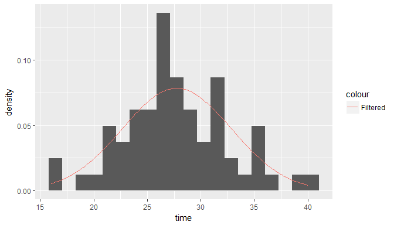

* * *

## Lab report

## Exercises


```r
newcomb
```

```
## # A tibble: 66 x 2
##     trial  time
##    <fctr> <int>
##  1      1    28
##  2      2   -44
##  3      3    29
##  4      4    30
##  5      5    24
##  6      6    28
##  7      7    37
##  8      8    32
##  9      9    36
## 10     10    27
## # ... with 56 more rows
```

#### Exercise 1


```r
ggplot(data = newcomb)+
  geom_boxplot(mapping = aes(x = "", y = time))
```

<!-- -->


```r
ggplot(data = newcomb)+
  geom_histogram(mapping = aes(x = time, y = ..density..), binwidth = 1)
```

<!-- -->

The center is a little above time 25, the shape apperas to be a bell curve with two extreme outliers below 0. The data is spread out due to the two outliers but with out the outliers the spread is more narrow.

#### Exercise 2


```r
newcomb_filter <- filter(newcomb, time > 0)
newcomb_filter
```

```
## # A tibble: 64 x 2
##     trial  time
##    <fctr> <int>
##  1      1    28
##  2      3    29
##  3      4    30
##  4      5    24
##  5      6    28
##  6      7    37
##  7      8    32
##  8      9    36
##  9     10    27
## 10     11    26
## # ... with 54 more rows
```


```r
ggplot(data = newcomb_filter)+
  geom_histogram(mapping = aes(x = time, y = ..density..), binwidth = 1)
```

<!-- -->


```r
ggplot(data = newcomb_filter)+
  geom_boxplot(mapping = aes(x = "", y = time))
```

<!-- -->


#### Exercise 3

flitered CDF


```r
ggplot(data = newcomb_filter, mapping = aes(x = time)) + stat_ecdf(geom = "step")
```

<!-- -->

Unfiltered CDF


```r
ggplot(data = newcomb, mapping = aes(x = time)) + stat_ecdf(geom = "step")
```

<!-- -->

This graph looks similar to the theoretical plot D in the previous lab, how it starts off low to 0 and then shoots upward to level out again.

#### Exercise 4

Summary of filtered data:


```r
summary(newcomb_filter$time)
```

```
##    Min. 1st Qu.  Median    Mean 3rd Qu.    Max. 
##   16.00   24.75   27.50   27.75   31.00   40.00
```


```r
sd(newcomb_filter$time)
```

```
## [1] 5.083431
```

IQR = 3rd Q - 1st Q


```r
31-24.75
```

```
## [1] 6.25
```

summary of unfiltered data:


```r
summary(newcomb$time)
```

```
##    Min. 1st Qu.  Median    Mean 3rd Qu.    Max. 
##  -44.00   24.00   27.00   26.21   30.75   40.00
```


```r
sd(newcomb$time)
```

```
## [1] 10.74532
```

IQR = 3rd Q - 1st Q


```r
30.75-24
```

```
## [1] 6.75
```

Variance and standard deviation change easily and so does the mean. The Median and IQR are not easily changed.

#### Exercise 5
Note: the 0.25 and the 0.75 refer the the third and first quartile.

Normality for the unfiltered dataset


```r
qq_x <- qnorm(p = c(0.25, 0.75))
qq_y <- quantile(x = newcomb$time, probs = c(0.25, 0.75), type = 1)
qq_slope <- diff(qq_y) / diff(qq_x)
qq_int <- qq_y[1] - qq_slope * qq_x[1]
```


```r
ggplot(data = newcomb)+
  geom_qq(mapping = aes(sample = time), color = "springgreen4")+
  geom_abline(slope = qq_slope, intercept = qq_int, size = 0.75, color = "coral1")
```

<!-- -->

The graph appears to show that the data has a fairly normal distribution, but with the outling points it is hard to tell.

Normality of the filtered dataset


```r
qq_x_filter <- qnorm(p = c(0.25, 0.75))
qq_y_filter <- quantile(x = newcomb_filter$time, probs = c(0.25, 0.75), type = 1)
qq_slope_filter <- diff(qq_y_filter) / diff(qq_x_filter)
qq_int_filter <- qq_y_filter[1] - qq_slope_filter * qq_x_filter[1]
```


```r
ggplot(data = newcomb_filter)+
  geom_qq(mapping = aes(sample = time), color = "darkgoldenrod1")+
  geom_abline(slope = qq_slope_filter, intercept = qq_int_filter, size = 0.75, color = "darkmagenta")
```

<!-- -->

Because the line on top of the points is a straight line, it means that this is a a normal distribution function.

#### Exercise 6


```r
unfiltered_mean <- mean(newcomb$time)
unfiltered_sd <- sd(newcomb$time)
filtered_mean <- mean(newcomb_filter$time)
filtered_sd <- sd(newcomb_filter$time)
d_unfiltered <- dnorm(newcomb$time, mean = unfiltered_mean, sd = unfiltered_sd)
d_filtered <- dnorm(newcomb_filter$time, mean = filtered_mean, sd = filtered_sd)
height_unfiltered <- 7/max(d_unfiltered)
height_filtered <- 7/max(d_filtered)
```


```r
ggplot(data = newcomb)+
  geom_histogram(mapping = aes(x = time, y = ..density..), binwidth = 1)+
  stat_function(mapping = aes(x = time, color = "Unfiltered"), fun = dnorm,
                args = c(mean = unfiltered_mean, sd = unfiltered_sd))+
  stat_function(mapping = aes(x = time, color = "Filtered"), fun = dnorm,
                args = c(mean = filtered_mean, sd = filtered_sd))
```

<!-- -->


```r
height_filtered
```

```
## [1] 89.30383
```


```r
ggplot(data = newcomb)+
  geom_histogram(mapping = aes(x = time), binwidth = 1)+
  stat_function(mapping = aes(x = time, color = "Unfiltered"), fun = function(x) dnorm(x, mean = unfiltered_mean, sd = unfiltered_sd) * height_unfiltered)+
  stat_function(mapping = aes(x = time, color = "Filtered"), fun = function(x) dnorm(x, mean = filtered_mean, sd = filtered_sd) * height_filtered)
```

<!-- -->


```r
ggplot(data = newcomb)+
  geom_histogram(mapping = aes(x = time), bins = 40)+
  stat_function(mapping = aes(x = time, color = "Unfiltered"), fun = dnorm,
                args = c(mean = unfiltered_mean, sd = unfiltered_sd))
```

<!-- -->
 

```r
ggplot(data = newcomb)+
  geom_histogram(mapping = aes(x = time), binwidth = 1)+
  stat_function(mapping = aes(x = time, color = "Unfiltered"), fun = function(x) dnorm(x, mean = unfiltered_mean, sd = unfiltered_sd) * height_unfiltered)
```

<!-- -->
 

```r
filtered_mean
```

```
## [1] 27.75
```

```r
filtered_sd
```

```
## [1] 5.083431
```
 

```r
ggplot(data = newcomb_filter)+
  geom_histogram(mapping = aes(x = time, y = ..density..), bins = 20)+
  stat_function(mapping = aes(x = time, color = "Filtered"),fun = dnorm,
                args = c(mean = filtered_mean, sd = filtered_sd))
```

<!-- -->
 

```r
ggplot(data = newcomb_filter)+
  geom_histogram(mapping = aes(x = time), binwidth = 1)+
  stat_function(mapping = aes(x = time, color = "Filtered"),fun = function(x) dnorm(x, mean = filtered_mean, sd = filtered_sd) * height_filtered)
```

<!-- -->
 
 
#### Exercise 7


```r
ggplot(data = newcomb)+
  geom_histogram(mapping = aes(x = time), binwidth = 1)+
  stat_function(mapping = aes(x = time, color = "Unfiltered"), fun = pnorm,
                args = c(mean = unfiltered_mean, sd = unfiltered_sd))
```

<!-- -->


```r
ggplot(data = newcomb)+
  geom_histogram(mapping = aes(x = time), binwidth = 1)+
  stat_function(mapping = aes(x = time, color = "Unfiltered"), fun = pnorm,
                args = c(mean = unfiltered_mean, sd = unfiltered_sd))+
  stat_function(mapping = aes(x = time, color = "Filtered"),fun = pnorm,
                args = c(mean = filtered_mean, sd = filtered_sd))
```

<!-- -->


```r
ggplot(data = newcomb_filter)+
  geom_histogram(mapping = aes(x = time), binwidth = 1)+
  stat_function(mapping = aes(x = time, color = "Filtered"),fun = pnorm,
                args = c(mean = filtered_mean, sd = filtered_sd))
```

<!-- -->


```r
ggplot(data = newcomb, mapping = aes(x = time)) + stat_ecdf(geom = "step")+
  stat_function(mapping = aes(x = time, color = "Unfiltered"), fun = pnorm,
                args = c(mean = unfiltered_mean, sd = unfiltered_sd))+
  stat_function(mapping = aes(x = time, color = "Filtered"),fun = pnorm,
                args = c(mean = filtered_mean, sd = filtered_sd))
```

<!-- -->

#### Exercise 8


```r
ggplot(data = newcomb, mapping = aes(x = time)) + stat_ecdf(geom = "step")+
  stat_function(mapping = aes(x = time, color = "Unfiltered"), fun = pnorm,
                args = c(mean = unfiltered_mean, sd = unfiltered_sd))+
  stat_function(mapping = aes(x = time, color = "Filtered"),fun = pnorm,
                args = c(mean = filtered_mean, sd = filtered_sd))
```

<!-- -->

Yes, based on the graph above, the filtered data set appears to fit the data and normal distribution better than the unfiltered data. This is probably due to the fact that the unfiltered data has two very drastic outliers that affect the normal distribution curve. 


#### Exercise 9


```r
devtools::install_github("andrewpbray/infer", dependencies = FALSE)
```

```
## Downloading GitHub repo andrewpbray/infer@master
## from URL https://api.github.com/repos/andrewpbray/infer/zipball/master
```

```
## Installing infer
```

```
## "C:/PROGRA~1/R/R-34~1.2/bin/x64/R" --no-site-file --no-environ --no-save  \
##   --no-restore --quiet CMD INSTALL  \
##   "C:/Users/athen/AppData/Local/Temp/RtmpUJ6mXl/devtools3a0408c2e76/andrewpbray-infer-5ff57e7"  \
##   --library="C:/Users/athen/Documents/R/win-library/3.4" --install-tests
```

```
## 
```

```
## Installation failed: Command failed (1)
```


```r
se_filtered <- filtered_sd / 64
se_unfiltered <- unfiltered_sd / 66
ci_filtered <- 2 * se_filtered
ci_unfiltered <- 2 * se_unfiltered
```

Filtered


```r
filtered_mean + ci_filtered
```

```
## [1] 27.90886
```

```r
filtered_mean - ci_filtered
```

```
## [1] 27.59114
```

Unfiltered


```r
unfiltered_mean + ci_unfiltered
```

```
## [1] 26.53774
```

```r
unfiltered_mean - ci_unfiltered
```

```
## [1] 25.88651
```

#### Exercise 10

Unfiltered bootstrap


```r
ebootstrap_mean <- newcomb %>%
  specify(response = time)%>%
  generate(reps = 1000, type = "bootstrap")%>%
  calculate(stat = "mean")
ebootstrap_mean
```

```
## # A tibble: 1,000 x 2
##    replicate     stat
##        <int>    <dbl>
##  1         1 25.89394
##  2         2 23.42424
##  3         3 26.69697
##  4         4 26.09091
##  5         5 27.92424
##  6         6 26.56061
##  7         7 26.01515
##  8         8 27.71212
##  9         9 26.87879
## 10        10 25.28788
## # ... with 990 more rows
```


```r
ggplot(ebootstrap_mean)+
  geom_histogram(mapping = aes(x = stat), bins = 40)
```

<!-- -->


```r
delta_mean <- ebootstrap_mean %>% mutate(mean_diff = stat - mean(newcomb$time))
percentile95 <- quantile(delta_mean$mean_diff, probs=c(0.025, 0.975), type = 1)
percentile95
```

```
##      2.5%     97.5% 
## -3.030303  2.106061
```


```r
mean(newcomb$time) - c(percentile95[2], percentile95[1])
```

```
##    97.5%     2.5% 
## 24.10606 29.24242
```

Filtered bootstrap


```r
ebootstrap_mean_filtered <- newcomb_filter %>%
  specify(response = time)%>%
  generate(reps = 1000, type = "bootstrap")%>%
  calculate(stat = "mean")
ebootstrap_mean_filtered
```

```
## # A tibble: 1,000 x 2
##    replicate     stat
##        <int>    <dbl>
##  1         1 27.92188
##  2         2 27.65625
##  3         3 27.10938
##  4         4 27.71875
##  5         5 27.65625
##  6         6 28.46875
##  7         7 27.53125
##  8         8 27.93750
##  9         9 27.84375
## 10        10 28.37500
## # ... with 990 more rows
```


```r
ggplot(ebootstrap_mean_filtered)+
  geom_histogram(mapping = aes(x = stat), bins = 40)
```

<!-- -->


```r
delta_mean_filtered <- ebootstrap_mean_filtered %>% mutate(mean_diff = stat - mean(newcomb$time))
percentile95_filtered <- quantile(delta_mean_filtered$mean_diff, probs=c(0.025, 0.975), type = 1)
percentile95_filtered
```

```
##      2.5%     97.5% 
## 0.3191288 2.7566288
```


```r
mean(newcomb_filter$time) - c(percentile95_filtered[2], percentile95_filtered[1])
```

```
##    97.5%     2.5% 
## 24.99337 27.43087
```

Using the bootstrap also shows that the unfiltered data is not as perfectly normally distributed though the bell curve, like the filtered data is, just like the ones comupted via the normal distribution.

#### Exercise 11

Null Hypothesis: The "true" mean value of 33.02 is due to random chance.

Alternate Hypothesis: The "true" mean value of 33.02 is not generated by chance alone.


#### Exercise 12


```r
ebootstrap_mean_pvalue <- newcomb %>%
  specify(response = time) %>%
  hypothesize(null = "point", mu = 33.02) %>%
  generate(reps = 1000, type = "bootstrap") %>%
  calculate(stat = "mean")
```


```r
d <- quantile(ebootstrap_mean_pvalue$stat, probs = c(0.025, 0.975), type = 1)
```


```r
print(c("tail cutoffs for two-sided hypothesis test with alpha = 0.05", d[1], d[2]))
```

```
##                                                                
## "tail cutoffs for two-sided hypothesis test with alpha = 0.05" 
##                                                           2.5% 
##                                             "29.8987878787879" 
##                                                          97.5% 
##                                             "35.2169696969697"
```


```r
ebootstrap_mean_pvalue_f <- newcomb_filter %>%
  specify(response = time) %>%
  hypothesize(null = "point", mu = 33.02) %>%
  generate(reps = 1000, type = "bootstrap") %>%
  calculate(stat = "mean")
```


```r
fd <- quantile(ebootstrap_mean_pvalue_f$stat, probs = c(0.025, 0.975), type = 1)
```


```r
print(c("tail cutoffs for two-sided hypothesis test with alpha = 0.05", fd[1], fd[2]))
```

```
##                                                                
## "tail cutoffs for two-sided hypothesis test with alpha = 0.05" 
##                                                           2.5% 
##                                                        "31.77" 
##                                                          97.5% 
##                                                      "34.4575"
```


```r
ggplot(ebootstrap_mean_pvalue)+
  geom_histogram(mapping = aes(x = stat, y = ..density.., fill = "Unfiltered"), bins = 40, alpha = .75)
```

<!-- -->


```r
ggplot(ebootstrap_mean_pvalue_f)+
  geom_histogram(mapping = aes(x = stat, y = ..density.., fill = "Filtered"), bins = 40, alpha = .75)
```

<!-- -->

## Additional questions

#### Question 1


```r
filtered_mean
```

```
## [1] 27.75
```

```r
filtered_sd
```

```
## [1] 5.083431
```

```r
unfiltered_mean
```

```
## [1] 26.21212
```

```r
unfiltered_sd
```

```
## [1] 10.74532
```


```r
ggplot(data = newcomb)+
  geom_histogram(mapping = aes(x = time), binwidth = 1)
```

<!-- -->


```r
ggplot(data = newcomb_filter)+
  geom_histogram(mapping = aes(x = time), binwidth = 1)
```

<!-- -->

Yes removing the dataset did have an effect on the shap of the distribution. The filtered data set shows a bell curve easier than the unfiltered data did because of its extream outliers. This does not mean that the outliers should always be removed. Sometimes they are important observations in the data. Unless there is a good justification outliers should not just be removed, they need a good reason to be taken out of the data. The dangers could lead to a miss conception of what the results are and if others try to replicate the data it may lead to falsifications.

#### Question 2

From my analysis in exercise 12, I do agree with the "true" mean value of 33.02. It is inconsistent because in exercise 12 it shows that both the filtered and unfiltered are around 33.02. That leads me to believe that the "true" mean value is around 33.02.


